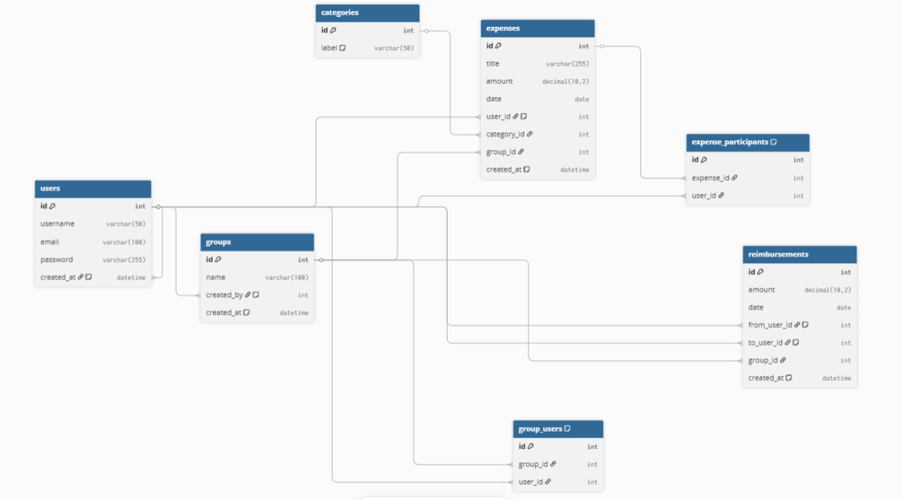

# FairCount : [découvrir le site](https://felixpm.alwaysdata.net/index.php?route=login)

Faircount est une application web conçue pour faciliter le suivi et la répartition des dépenses au sein d'un groupe (colocation, voyage, événement). Il permet de savoir rapidement "Qui doit combien à qui".

## Fonctionnalités Clés

- Inscription et Connexion des utilisateurs
- Création de groupes de remboursement
- Enregistrement des Dépenses d'un groupe
- Détail des remboursements à effectuer entre les membres du groupe

## 🛠️ Technologies utilisées

 <table>
   <thead>
      <tr>
        <th align="center">
          <h3 style="color:#38bdf8;">Backend</h3>        
        </th>
        <th align="center">
          <h3 style="color:#38bdf8;">Frontend</h3>        
        </th>
        <th align="center">
          <h3 style="color:#38bdf8;">Base de Données</h3>       
        </th>
      </tr>
   </thead>
   <tbody>
        <tr>
            <td align="center"></td>
            <td align="center"></td>
            <td align="center"></td>
        </tr>
    </tbody>
   
  </table>

  ## 👥 Contributeurs & Projet de Groupe

Ce projet est un projet académique réalisé en équipe de 3 étudiants.  
Il applique l'ensemble des notions vues au cours de nos 3 semaines de cours sur le langage php:

- Manipulation d'une base de données SQL
- Programmation Orientée Objet (POO)
- Mise en place d'une architecture MVC (Model Vue Controller)
- Utilisation des librairies twig et dotenv 

### Répartition des tâches dans le Groupe

[**Eliot TOURTELIER**](https://github.com/Eliottr45):  
Réalisation de la partie remboursement du site et mise en place de la structure de base des Contrôleurs, Modèles et Vues du site

[**Félix PARENDEAU MILLERIOUX**](https://github.com/felix-pm):  
Réalisation du css du site et mise en place de la structure de base des Contrôleurs, Modèles et Vues du site

[**Pierre SOREAU**](https://github.com/PierreSoreau):  
Réalisation de la partie dépense et création des groupes de dépense du site

### Structure de la base de données du site

### Difficultés rencontrées

L'une des principales difficultés rencontrées lors de la phase de développement a concerné l'optimisation de la gestion des données entre les couches Modèle (Managers) et Vue (Templates).

Nous avons initialement concentré nos efforts sur la création de fonctions très génériques et "gourmandes en données" au niveau des Managers, dans le but d'être exhaustifs.

Cependant, nous avons rapidement réalisé que cette approche menait à un surchargement des Modèles avec des données inutiles et des performances moins optimales.

La leçon apprise a été de basculer vers une approche plus pragmatique : déterminer précisément les besoins en données directement depuis les Templates pour ensuite créer des fonctions Managers ciblées et minimales. Bien que cette réorientation ait occasionné une perte de temps initiale, elle garantit désormais une meilleure performance et une maintenabilité accrue du code.

